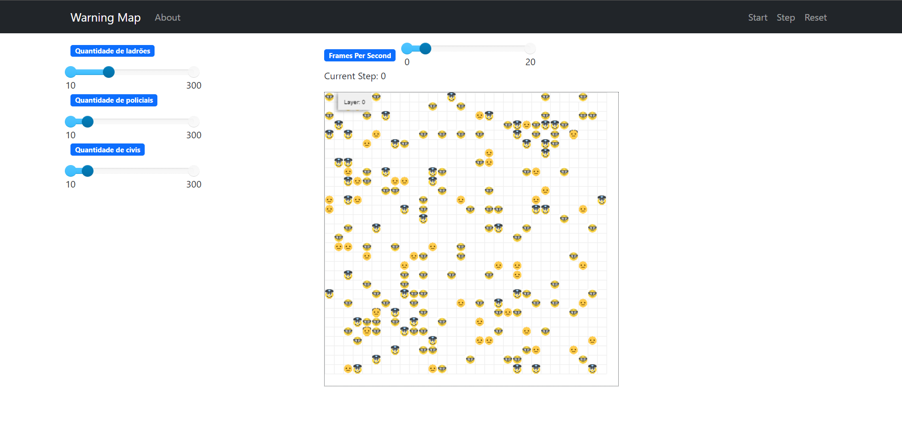

# Mapa de Perigo

**Disciplina**: LINGUAGENS E PARADIGMAS DE PROGRAMAÇÃO  
**Paradigma**: SMA 

## Aluna

Thailane Lopes Dutra

## Sobre

Esse é um software SMA que se baseia em relacionamento entre os agentes: pessoa, ladrão e polícia. O ladrão pode assaltar a pessoa fazendo que que ela se torne uma vítima e consequentemente irá mudar seu emoji. Mas para salvar a pessoa há o policial que se encontrar um ladrão ele o prende, fazendo com que o ladrão saia da grid, salvando as pessoas.

## Screenshots

## Instalação

**Linguagens**: python 
**Tecnologias**: MESA 
Para conseguir usar o projeto, é necessario ter o python(Recomendado python 3.10) e o framework MESA instalado na máquina.

## Uso

Para roda o projeto, Basta clonar o repositório e utilizar o comando `docker-compose up`, o que fará o orquestrador subir os containeres:
</code></pre>
e rodar:
<pre><code> sudo docker-compose up
</code></pre>

É necessário que tenha os pré-requisitos `Docker` e `Docker Compose` instalados
